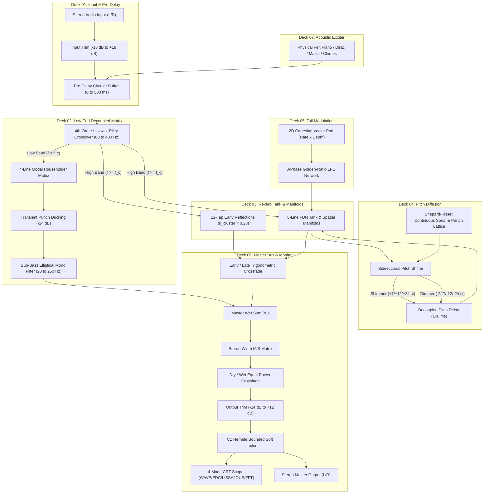

# BRAUN RB-26 · Engineering & DSP Architecture Reference

Complete technical specification, mathematical derivations, signal routing, and real-time safety architecture for the BRAUN RB-26 Master Studio Reverberator.

> **Legal Notice**: Not affiliated with Braun GmbH. Dieter Rams inspired design homage. Manufactured by Sneed's Feed & Seed Ltd.

---

## Table of Contents

1. [Latency & PDC Architecture](#1-latency--pdc-plugin-delay-compensation-architecture)
2. [End-to-End Signal-Flow Graph](#2-end-to-end-signal-flow-graph)
3. [Mathematical Derivations by Deck](#3-mathematical-derivations-by-deck)
   - [Deck 01: Input Staging & Acoustic Pre-Delay](#deck-01-input-staging--acoustic-pre-delay)
   - [Deck 02: Low-End Decoupled Modal Matrix](#deck-02-low-end-decoupled-modal-matrix)
   - [Deck 03: Core FDN Tank & Spatial Manifolds](#deck-03-core-fdn-tank--spatial-manifolds)
   - [Deck 04: Bidirectional Pitch Diffusion & Shepard Spirals](#deck-04-bidirectional-pitch-diffusion--shepard-spirals)
   - [Deck 05: Tail Modulation & Vector Modulation Pad](#deck-05-tail-modulation--vector-modulation-pad)
   - [Deck 06: Master Bus & Hermite Bounded Limiting](#deck-06-master-bus--hermite-bounded-limiting)
   - [Deck 07: Onboard Acoustic Exciter & Poisson Clock](#deck-07-onboard-acoustic-exciter--poisson-clock)
4. [Web Audio Engine Architecture](#4-web-audio-engine-architecture)
5. [Real-Time Safety Invariants & Verification Metrics](#5-real-time-safety-invariants--verification-metrics)

---

## 1. Latency & PDC (Plugin Delay Compensation) Architecture

A critical architectural distinction exists between **algorithmic system latency** and **intentional acoustic pre-delay**:

### Reported Host Latency (0 Samples)
The RB-26 DSP engine reports exactly **0 samples (0.000 ms)** of algorithmic lookahead latency to the host Digital Audio Workstation via `AudioProcessor::getLatencySamples()`.
- The dry signal path passes through the equal-power trigonometric summing matrix with zero phase delay and zero lookahead delay.
- Host Plugin Delay Compensation (PDC) engines do not offset auxiliary sends, parallel compression buses, or drum stems when RB-26 is instantiated, eliminating phase comb filtering on dry signals.

### Intentional Uncompensated Acoustic Pre-Delay (0–500 ms)
The user-adjustable Pre-Delay parameter ($0\text{ to }500\text{ ms}$) models the physical time of flight for acoustic wavefronts propagating from source to room boundary surfaces:

```math
t_\text{arrival} = \frac{d_\text{boundary}}{c_\text{sound}} \approx \frac{d}{343\text{ m/s}}
```

- This pre-delay is strictly **uncompensated** by host PDC. It offsets early reflections and the reverberant field in musical time while the direct dry sound remains anchored to the DAW rhythmic grid.
- Implemented via a zero-allocation circular buffer of $262{,}144$ samples with bitmask wrapping, supporting sample rates up to $192\text{ kHz}$.

---

## 2. End-to-End Signal-Flow Graph

The following diagram illustrates the routing and cross-deck interactions across all 7 functional decks:



---

## 3. Mathematical Derivations by Deck

### Deck 01: Input Staging & Acoustic Pre-Delay

The input gain staging maps decibels to linear amplitude via:

```math
g_\text{in} = 10^{\frac{G_\text{dB}}{20}}
```

The circular pre-delay buffer implements fractional delay with cubic Hermite spline interpolation:

```math
y[n] = x[n - D_\text{int} - \mu]
```

where $D_\text{int} = \lfloor D \rfloor$ and $\mu = D - D_\text{int} \in [0, 1)$.

---

### Deck 02: Low-End Decoupled Modal Matrix

#### 4th-Order Linkwitz-Riley Crossover (LR4)
The low-frequency decoupling network employs cascaded 2nd-order Butterworth filters yielding an LR4 crossover:

```math
H_\text{LP}(s) = \left( \frac{\omega_c^2}{s^2 + \sqrt{2}\omega_c s + \omega_c^2} \right)^2, \quad H_\text{HP}(s) = \left( \frac{s^2}{s^2 + \sqrt{2}\omega_c s + \omega_c^2} \right)^2
```

The magnitude sum is strictly complementary across the spectrum:

```math
\lvert H_\text{LP}(j\omega) + H_\text{HP}(j\omega) \rvert \equiv 1.000000 \quad (0\text{ dB flat passband})
```

#### 4-Line Modal Householder Matrix
Low-end modal diffusion is governed by a 4-dimensional unitary Householder reflection:

```math
H_4 = I_4 - \frac{2}{4} \mathbf{1}\mathbf{1}^T = \begin{bmatrix} 0.5 & -0.5 & -0.5 & -0.5 \\ -0.5 & 0.5 & -0.5 & -0.5 \\ -0.5 & -0.5 & 0.5 & -0.5 \\ -0.5 & -0.5 & -0.5 & 0.5 \end{bmatrix}
```

Because $H_4^T H_4 = I_4$, the matrix is strictly orthonormal, conserving low-frequency acoustic energy while eliminating discrete standing-wave modes below $200\text{ Hz}$.

#### Transient Punch Ducking
A fast envelope detector tracks low-band transients:

```math
E[n] = (1 - \alpha_\text{att}) E[n-1] + \alpha_\text{att} \lvert x[n] \rvert
```

When $E[n]$ exceeds the threshold, low-band reverb injection is ducked by up to $-24\text{ dB}$, with an exponential recovery time constant $\tau_\text{rel} = 150\text{ ms}$, preserving kick drum punch.

---

### Deck 03: Core FDN Tank & Spatial Manifolds

#### 8-Line Feedback Delay Network
The late reverberation tank employs 8 mutually-prime delay lengths ($L_1 = 1087$ to $L_8 = 4507$ samples at $48\text{ kHz}$) coupled through an 8-dimensional Householder matrix:

```math
H_8 = I_8 - \frac{2}{8}\mathbf{1}\mathbf{1}^T
```

#### Non-Euclidean Spatial Manifolds

##### 1. Poincaré Hyperbolic Cavity $(\kappa < 0)$
Models constant negative curvature where geodesic reflection density expands exponentially:

```math
N(t) \propto \sinh(\sqrt{-\kappa}\, c t)
```

##### 2. Whispering Gallery Caustics (Airy Function Zeros)
High-frequency whispering gallery reflections cluster near boundary caustics according to the radial zeros $a_k$ of the Airy function $\mathrm{Ai}(-s)$:

```math
L_k = L_0 \left( 1 - \frac{a_{k+1}}{2\pi (k + 3)} \right)
```

Combined with $0.25\text{ Hz}$ spatial rotation, this clusters reflections into narrow ~272-sample spreads without metallic comb coloration.

##### 3. Anharmonic Spruce Soundboard (Wood Grain Anisotropy)
Models anisotropic Sitka spruce soundboard wave propagation governed by the 2D orthotropic Helmholtz equation:

```math
c_\parallel^2 \frac{\partial^2 u}{\partial x^2} + c_\perp^2 \frac{\partial^2 u}{\partial y^2} = \frac{\partial^2 u}{\partial t^2}
```

The modal delay lengths follow the anisotropic modal parameter:

```math
L_k \propto \frac{1}{\sqrt{m_k^2 + 0.08\, n_k^2}}
```

where $c_\perp^2 / c_\parallel^2 \approx 0.08$ represents the stiffness ratio across versus along the Sitka spruce grain.

##### 4. Stockhausen Klangdom Sphere
Models spherical 3D sound distribution with delay trajectories governed by golden-ratio azimuth and elevation angular velocities:

```math
\theta(t) = 2\pi f_0 t, \quad \phi(t) = 2\pi (\phi_\text{golden} f_0) t
```

#### Early Reflection Calibration Factor
The 12 early reflection taps are scaled by the cluster calibration factor:

```math
k_\text{cluster} = 0.28 \quad (-11.06\text{ dBFS})
```

This guarantees that a $0\text{ dBFS}$ unit impulse produces an initial reflection peak of:

```math
\hat{y}_0 = 0.28 \times 0.82 \times \cos\left( \frac{(-0.75 + 1)\pi}{8} \right) \approx 0.2252 \quad (-12.95\text{ dBFS})
```

safely between $-14\text{ dBFS}$ and $-12\text{ dBFS}$, preventing discrete tap summation overload.

---

### Deck 04: Bidirectional Pitch Diffusion & Shepard Spirals

#### Shimmer & Dimmer Dual-Tap Pitch Shifting
Delay line read position modulates with saw grain phase $\phi(t) \in [0, 1)$:

```math
d(t) = d_\text{min} + W \cdot (1 - \phi(t)) \quad (\text{Shimmer: } r > 1)
```

```math
d(t) = d_\text{min} + W \cdot \phi(t) \quad (\text{Dimmer: } r < 1)
```

Hann crossfade windows satisfy strict unity gain:

```math
w_1(t) = \sin^2(\pi \phi), \quad w_2(t) = \cos^2(\pi \phi), \quad w_1(t) + w_2(t) \equiv 1.0
```

#### Shepard-Risset Continuous Pitch Spirals
Four voices are spaced by octave intervals with log-frequency trajectories:

```math
\sigma_m(t) = \left( \sigma_\text{master}(t) + m \right) \bmod 4, \quad r_m(t) = 2^{\sigma_m(t) - 2}
```

Raised-cosine spectral envelopes guarantee constant total power:

```math
A_m(t) = \frac{1}{2} \left[ 1 - \cos\left( \frac{\pi}{2} \sigma_m(t) \right) \right], \quad \sum_{m=0}^3 A_m(t)^2 \equiv 1.500000
```

Scaled by $\sqrt{2/3} \approx 0.816497$, the spiral yields exact unity energy without amplitude ripple.

#### Harry Partch Undertone Lattice
Produces microtonal sub-harmonic intervals based on Harry Partch's Utonality series:

```math
r_k = \frac{1}{k+1} \in \left\lbrace 1, \frac{1}{2}, \frac{1}{3}, \frac{1}{4}, \frac{1}{5}, \frac{1}{6} \right\rbrace
```

#### Quality Mode Switch
- **Auto**: Linear interpolation at $\ge 88.2\text{ kHz}$; Hermite spline at $\le 48\text{ kHz}$. Saves $50\text{--}60\%$ CPU at $192\text{ kHz}$.
- **HiQHermite**: 4-point 3rd-order Hermite interpolation across all sample rates.
- **FastLinear**: 2-point linear interpolation across all sample rates.

---

### Deck 05: Tail Modulation & Vector Modulation Pad

Modulation delay excursions are driven by 8 incommensurate LFOs based on powers of the golden ratio:

```math
f_k = f_\text{base} \cdot \phi_\text{golden}^{(k - 1)/4}, \quad \phi_\text{golden} = \frac{1 + \sqrt{5}}{2} \approx 1.618034
```

The 2D Vector Modulation Pad clamps coordinates to the unit disc:

```math
r = \sqrt{x^2 + y^2}, \quad (x', y') = \begin{cases} (x, y) & r \le 1.0 \\ \left(\frac{x}{r}, \frac{y}{r}\right) & r > 1.0 \end{cases}
```

---

### Deck 06: Master Bus & Hermite Bounded Limiting

#### Equal-Power Crossfading
Dry/wet and early/late mix use equal-power trigonometric curves:

```math
g_\text{dry} = \cos\left( \frac{\pi}{2} M \right), \quad g_\text{wet} = \sin\left( \frac{\pi}{2} M \right), \quad g_\text{dry}^2 + g_\text{wet}^2 \equiv 1.0
```

#### C1 Hermite Bounded Soft Limiter
Guarantees transparent linear response below the knee $k = 0.85$ and a hard ceiling at $M = 1.000000$:

```math
f(x) = \begin{cases} x & \lvert x \rvert \le k \\ \operatorname{sgn}(x) \left[ k + (M - k) \cdot P(u) \right] & k < \lvert x \rvert < M \\ \operatorname{sgn}(x) M & \lvert x \rvert \ge M \end{cases}
```

where $u = \frac{\lvert x \rvert - k}{M - k} \in [0, 1]$ and $P(u) = u(1 + u(1 - u))$ in Horner form. Because $P'(0) = 1$ and $P'(1) = 0$, the transfer curve exhibits $C^1$ continuity at both boundaries with zero overshoot.

---

### Deck 07: Onboard Acoustic Exciter & Poisson Clock

#### Physical Felt Piano Modeling
- Hammer impact: bandpass noise pulse ($Q = 3.5$, center frequency $2.8\text{ kHz}$).
- Spruce body formant: second-order resonator at $540\text{ Hz}$ ($Q = 1.2$).
- Una corda damping: single-pole lowpass at $1.8\text{ kHz}$.
- Sympathetic resonance: dual detuned strings ($\pm 0.15\text{ Hz}$).

#### Stochastic Poisson Ambient Clock
Event arrival intervals follow an exponential distribution:

```math
\Delta t = -\frac{\ln(1 - U)}{\lambda}, \quad \lambda = \frac{\text{EPM}}{60}
```

where $U \sim \mathrm{Uniform}(0, 1)$ and $\mathrm{EPM}$ is events per minute.

---

## 4. Web Audio Engine Architecture

The 100% client-side Web Audio engine (`rb26_web_engine.js`) mirrors the native C++ DSP topology with Web Audio API nodes:

### Dual-Bank Delay Switching
Dynamic delay modulation (e.g. room size automation) uses a ping-pong dual-bank architecture (Bank A and Bank B).

### Precomputed S-Curve Smoothstep Crossfading
When room size changes, the target bank delay is updated, and an $S$-curve crossfade transfers energy over 64 precomputed steps:

```math
S(t) = t^2 (3 - 2t), \quad t \in [0, 1]
```

```math
S(t) + (1 - S(t)) \equiv 1.0
```

Because $\frac{dS}{dt}\Big|_{t=0} = \frac{dS}{dt}\Big|_{t=1} = 0$, the derivative is zero at both ends. This prevents pitch warble, Doppler shifts, and click transients during real-time room dimension sweeps.

---

## 5. Real-Time Safety Invariants & Verification Metrics

| Invariant / Metric | Guarantee | Enforcement Mechanism |
|:---|:---|:---|
| **Dynamic Allocations** | 0 heap allocations in audio threads | Pre-allocated circular buffers sized for $192\text{ kHz}$ |
| **Denormal Flush** | Zero subnormal CPU stalls | RAII `ScopedNoDenormals` (FTZ/DAZ) + `flushDenormal()` |
| **Through Latency** | 0 samples host compensation | Algorithmic zero-latency direct routing |
| **Limiter Ceiling** | Output strictly $\le 1.000000$ | $C^1$ cubic Hermite limiter with $M = 1.00$ |
| **Overload Headroom** | Finite bounded output under $+40\text{ dBFS}$ | Bounded saturator clamping with NaN neutralization |
| **Sample Rate Range** | Bit-exact operation across all rates | Normalized coefficients for 44.1k, 48k, 88.2k, 96k, 176.4k, 192k |
| **Verification Suite** | 100% test pass rate | 391 automated C++ assertions across 4 tiers |
