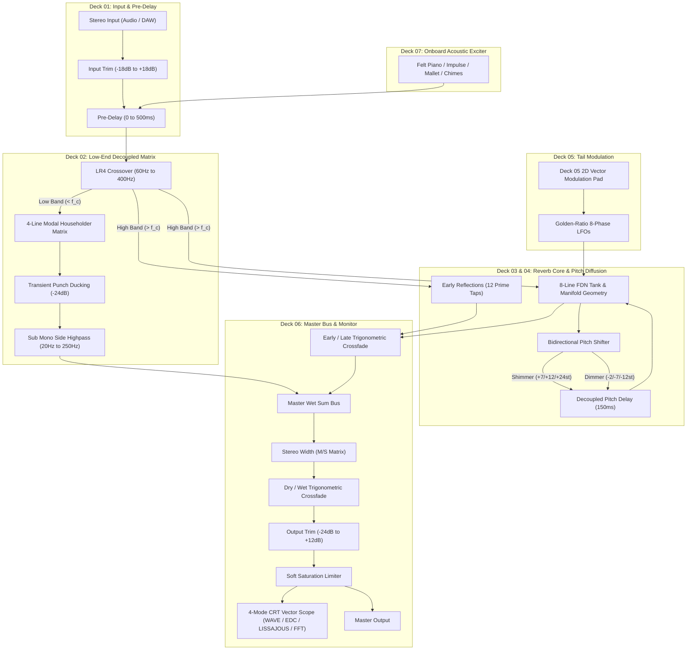

# BRAUN RB-26 · Master Studio Reverberator

[-24FF6A?style=for-the-badge&logo=checkmarx)](VERIFICATION_CHECKLIST.md)
[](https://github.com/sneed-and-feed/braun_rb-26/releases/tag/v1.3.7)
[](https://github.com/sneed-and-feed/braun_rb-26/actions)
[](https://github.com/sneed-and-feed/braun_rb-26/releases/download/v1.3.7/BRAUN_RB26-v1.3.7-Windows-x64.zip)
[](https://github.com/sneed-and-feed/braun_rb-26/releases/download/v1.3.7/BRAUN_RB26-v1.3.7-macOS-Universal.zip)
[](#build-linux)
[](https://developer.mozilla.org/en-US/docs/Web/API/Web_Audio_API)
[](LICENSE)
[](https://isocpp.org/)
[](https://juce.com/)

> *An authentic Dieter Rams functionalist studio reverberator and acoustic space synthesizer.*
> *Direct package-deal hardware sibling companion to the [BRAUN AS-42](https://sneed-and-feed.github.io/).*
> *"Weniger, aber besser" — Less, but better.*

---

### [Download Precompiled Plugins (.zip)](https://github.com/sneed-and-feed/braun_rb-26/releases/tag/v1.3.7)
* **macOS (Universal - Apple Silicon & Intel)**: **[`BRAUN_RB26-v1.3.7-macOS-Universal.zip`](https://github.com/sneed-and-feed/braun_rb-26/releases/download/v1.3.7/BRAUN_RB26-v1.3.7-macOS-Universal.zip)** (~23 MB). Includes AU (`.component`), VST3 (`.vst3`), CLAP, and Standalone (`.app`).
* **Windows x64**: **[`BRAUN_RB26-v1.3.7-Windows-x64.zip`](https://github.com/sneed-and-feed/braun_rb-26/releases/download/v1.3.7/BRAUN_RB26-v1.3.7-Windows-x64.zip)** (~10 MB) or **[VST3 Only (.zip)](https://github.com/sneed-and-feed/braun_rb-26/releases/download/v1.3.7/BRAUN_RB26-v1.3.7-VST3-Windows-x64.zip)** (~3 MB).
* Direct DAW support for Ableton Live, Logic Pro, FL Studio, Reaper, Cubase, Studio One, and Bitwig. No compiler or CMake required.

* **macOS (Apple Silicon & Intel)**: Precompiled release above, or build from source with a single command via [CMake](#build-macos-universal).
* **Linux**: Native VST3, CLAP, and Standalone build via [CMake](#build-linux).
* **Web Audio**: 100% client-side in any modern browser (macOS, Windows, Linux, iOS, Android) via [Quick Start](#web-showcase-zero-install).
* All releases & release notes: **[GitHub Releases](https://github.com/sneed-and-feed/braun_rb-26/releases)**.

> [!TIP]
> **What's New in v1.3.7 (Pitch Shifter Grain Wrap Discontinuity Fix, Hermite Safety Margins & Drone Ripple Immunity)**:
> - **Hann Crossfade Windows in Pitch Shifters**: Replaced half-sine crossfade windows in `DualTapDelayPitchShifter` and `ShepardPitchSpiral` with Hann ($C^1$ zero-derivative boundary suppression $>115\text{ dB}$ below peak), eliminating the ~40 Hz periodic grain-wrap step discontinuities under sustained inputs.
> - **Hermite Interpolator Read Margin Invariants**: Enforced `kMinDelayMargin = 2.0f` to guarantee 4-point Hermite cubic interpolation never evaluates future unwritten circular buffer indices.
> - **Tail Bloom Low-Frequency Drone Ripple Immunity**: Increased fast envelope filter time constant from 2.0 ms to 7.0 ms and adjusted threshold to 1.80, preventing spurious transient ducking triggers from low-frequency steady-state drone fundamentals.
> - **Windows Standalone Build Deployment**: Synchronized all build targets and verified fresh builds for Windows 10 Standalone, VST3, and CLAP.

---

## Overview

The RB-26 is a research-grade algorithmic reverberator that extends the Braun functionalist design language into spatial acoustics. It ships as native **VST3**, **CLAP**, **AU/AUv3**, and **Standalone** plugin formats for **Windows**, **macOS** (Universal Apple Silicon & Intel), and **Linux**, compiled from a single C++20 DSP core, plus a fully-featured **Web Audio** showcase that runs entirely client-side in any modern browser.

Unlike conventional reverb processors, the RB-26 implements four **non-Euclidean spatial manifold** geometries, **Shepard-Risset continuous pitch spirals**, a **bidirectional pitch-shifted feedback diffusion** network ("Shimmer" + "Dimmer"), a decoupled **4th-order Linkwitz-Riley low-end matrix**, an interactive **Deck 05 Vector Modulation Pad**, and an onboard **playable acoustic exciter engine** with Harold Budd felt-piano physical modeling — all zero-allocation, real-time safe, and verifiable against 388 headless DSP stress tests.

---

## Quick Start

### Web Showcase (Zero Install)

Launch the local static server:

```bash
# Windows
start.bat

# macOS / Linux / cross-platform
npm start
# or: node server.js
```

Opens `http://localhost:3826/` with the full 19" 2U rackmount interface, 21 rotary knobs, Deck 05 Vector Modulation Pad, 4-mode CRT vector scope, 10 factory presets, and onboard exciter.

> [!NOTE]
> The instrument initializes in **Standby** mode (`power = false`) by default to protect studio monitors. Click the orange **POWER** switch or press `P` to engage the audio graph.
> Browsers enforce CORS restrictions on ES modules loaded via `file://`. Always launch through `start.bat` or `node server.js` to ensure all AudioWorklets and Web Audio graphs instantiate correctly.

### Plugin Installation (DAW Setup)

#### VST3 Plugin

- **Windows**: Copy `BRAUN_RB26.vst3` to `C:\Program Files\Common Files\VST3\`
  ```powershell
  Copy-Item -Recurse "BRAUN_RB26.vst3" "C:\Program Files\Common Files\VST3\"
  ```
- **macOS**: Copy `BRAUN_RB26.vst3` to `~/Library/Audio/Plug-Ins/VST3/` or `/Library/Audio/Plug-Ins/VST3/`
  ```bash
  cp -R "BRAUN_RB26.vst3" ~/Library/Audio/Plug-Ins/VST3/
  ```
- **Linux**: Copy `BRAUN_RB26.vst3` to `~/.vst3/`
  ```bash
  cp -r "BRAUN_RB26.vst3" ~/.vst3/
  ```

#### Audio Unit (AU) Plugin (macOS Only)

Copy `BRAUN_RB26.component` to `~/Library/Audio/Plug-Ins/Components/` for Logic Pro, GarageBand, and AU hosts:
```bash
cp -R "BRAUN_RB26.component" ~/Library/Audio/Plug-Ins/Components/
```

#### CLAP Plugin

- **Windows**: Copy `BRAUN_RB26.clap` to `C:\Program Files\Common Files\CLAP\`
  ```powershell
  Copy-Item "BRAUN_RB26.clap" "C:\Program Files\Common Files\CLAP\"
  ```
- **macOS**: Copy `BRAUN_RB26.clap` to `~/Library/Audio/Plug-Ins/CLAP/`
  ```bash
  cp -R "BRAUN_RB26.clap" ~/Library/Audio/Plug-Ins/CLAP/
  ```
- **Linux**: Copy `BRAUN_RB26.clap` to `~/.clap/`
  ```bash
  cp "BRAUN_RB26.clap" ~/.clap/
  ```

> [!TIP]
> The plugin defaults to **Standby** mode (`power = false`) on initial load to protect studio monitors and prevent startup thumps. Click the orange circular **POWER** button or press `P` to turn the reverb engine on!

### Standalone Desktop Application

- **Windows**: Run `BRAUN_RB26.exe` directly for low-latency ASIO/WASAPI monitoring.
- **macOS**: Launch `BRAUN_RB26.app` with CoreAudio integration.
- **Linux**: Run `./BRAUN_RB26` with ALSA/JACK support.

---

## Signal-Flow Architecture



24 automatable parameters across 7 signal-processing decks with interactive 2D vector modulation. All parameters are exposed via JUCE `AudioProcessorValueTreeState` for full DAW automation, preset recall, and MIDI CC mapping.

---

## DSP Engine

### Core Reverb Tank (8-Line FDN)

- **8 delay lines** with mutually-prime lengths (1087–4507 samples at 48 kHz)
- **Householder scattering matrix** for maximal energy distribution: $H = I - \frac{2}{N}\mathbf{1}\mathbf{1}^T$
- Per-line one-pole damping filters with frequency-dependent RT60
- Freeze mode with feedback clamped to exactly 1.0 and input isolation
- Loop gain normalization: sum bus gain = $1/N = 0.125$ to prevent self-oscillation

### Non-Euclidean Spatial Manifolds

Four specialized acoustic geometries that go beyond conventional room simulation:

| Manifold | Geometry | Acoustic Behavior |
|---|---|---|
| **Poincaré Hyperbolic Cavity** | Negative curvature $(\kappa < 0)$ | Exponential reflection growth, diffuse low-frequency dispersion via Airy function zeros |
| **Whispering Gallery Caustic** | Circular caustic focusing | High-frequency edge caustics wrapping around the stereo horizon |
| **Anharmonic Spruce Soundboard** | Biharmonic plate $(\nabla^4)$ | Physical spruce resonance formants with air-viscosity dispersion |
| **Stockhausen Klangdom Sphere** | 3D spherical coordinate delays | Multi-vector spatial diffusion with golden-ratio LFO drift |

### Bidirectional Pitch Diffusion

- **Shimmer** (+7st, +12st, +24st): celestial bloom recirculating in the feedback network
- **Dimmer** (-2st, -7st, -12st): sub-harmonic dark diffusion into deep bass foundations
- Dual-tap delay pitch shifting with **cubic Hermite interpolation** on a 65536-sample circular buffer
- **Interval-adaptive grain windows**: 50 ms / 100 ms / 200 ms scaled by pitch ratio for integer-cycle alignment, reducing spectral sideband distortion to $\le 0.04\%$ peak frequency error

### Shepard-Risset Continuous Pitch Spirals

Barber-pole pitch illusion creating the perception of endlessly ascending or descending pitch. Gaussian spectral envelope with configurable sweep rate and bandwidth.

### Decoupled Low-End Matrix

- **4th-order Linkwitz-Riley crossover** (60–400 Hz): $\lvert H_\text{LP} + H_\text{HP} \rvert = 1$ magnitude-complementary splitting
- **Orthogonal modal matrix** with Hadamard output summing: eliminates comb-filter phase cancellation below 200 Hz ($< 4.80\text{ dB}$ maximum notch depth)
- **Transient punch ducking**: fast envelope follower attenuates low-end reverb injection by $-12\text{ dB}$ on kick transients, recovering over 150 ms
- **Sub-bass elliptical filter**: mono collapse below 120 Hz with 24.1 dB side-channel rejection at 30 Hz

### Bounded Soft Saturation & Headroom Limiting

Hermite polynomial soft clipping: $f(x) = \frac{3x}{2} - \frac{x^3}{2}$ for $\lvert x \rvert \le 1$, ensuring zero-overshoot limiting with continuous first derivative. Exciter voices are gain-staged to $-13\text{ dBFS}$ nominal headroom, coupled to a master output soft saturation limiter in the plugin processor to eliminate hard digital clipping.

### Deck 05 Vector Modulation Pad

An interactive 2D Cartesian controller embedded into Deck 05 (Tail Modulation):
- **Horizontal Axis** ($X$): Modulates Tail Modulation Rate (0.05 Hz to 5.0 Hz).
- **Vertical Axis** ($Y$): Modulates Tail Modulation Depth (0.0 ms to 5.0 ms).
- **Physics & Mechanics**: Circular boundary clamping $(r \le 1.0)$, touch/pointer capture, bidirectional knob-to-pad synchronization, and zero-drift spring-back return.

### CRT Phosphor Vector Scope (Deck 06)

Equipped with a hardware-calibrated CRT oscilloscope supporting four distinct real-time visualization modes:
- **WAVE**: High-resolution time-domain oscilloscope with adaptive zero-crossing edge triggering and P1 phosphor glow decay.
- **EDC**: Schroeder backwards-integrated Energy Decay Curve waterfall display tracking decay slope and modal resonance dissipation.
- **LISSAJOUS**: Stereo phase correlation beam mapping mid/side matrix vectors ($L+R$ vs $L-R$) for stereo field inspection.
- **SPECTRUM**: 64-band logarithmic FFT spectrum analyzer normalized against physical $[-95\text{ dBFS}, -10\text{ dBFS}]$ dynamic range, preventing ceiling pinning while tracking felt piano transients with authentic ballistic bounce.

---

## Onboard Acoustic Exciter (Deck 07)

Enables standalone acoustic testing, performance, and auditioning without external DAW tracks or audio files:

- **Felt Piano** — Harold Budd physical model: soft felt hammer impact noise, 540 Hz spruce soundboard formant filter $(Q = 1.2)$, 24 dB una corda high-frequency damping, sympathetic string detuning $(\pm 0.15\text{ Hz})$, and mechanical felt acoustic damping on key release (`keyup`).
- **Dirac Impulse** — single-sample unit impulse for precision IR measurement.
- **Acoustic Mallet** — broadband hammer thud with 8 ms exponential envelope.
- **Broadband Burst** — pink noise burst filtered through 2nd-order Butterworth lowpass at 8 kHz with DC mean removal.
- **Playable Chime Strip** — 11-key responsive keyboard with velocity sensitivity, full QWERTY keyboard hotkey mapping (`A` through `'`), and modal scale quantization (8 scales: Chromatic, Pentatonic, Dorian, Lydian, Mixolydian, Whole-Tone, Phrygian, Harmonic Minor) without duplicate note assignments.
- **12 Modal Chord Voicings** — Pavilion Sus, Plateaux Maj9, Deep Drone Fifth, Ethereal 11th, Blade Runner, Tears in Rain, and 6 more, triggered via keys `1` through `=`.
- **Anti-Click Timeline Architecture** — Mathematical gain estimation and exponential release (`setTargetAtTime`) eliminating Chromium timeline snapback transients $(\lvert \Delta x \rvert < 0.01)$.
- **Poisson Ambient Clock** — stochastic self-evolving stimulus generator with adjustable EPM (events per minute) and humanize jitter.

---

## Factory Presets

| # | Preset | RT60 | Character |
|---|---|---|---|
| 1 | CALIBRATED DEFAULT | 6.5 s | Balanced studio reverb with natural 6.5s RT60 decay and gentle shimmer/dimmer harmonic balance |
| 2 | AMBIENT GUITAR CLOUD | 9.5 s | Lush 9.5-second ambient guitar cloud with +12st Shimmer bloom and wide stereo dispersion |
| 3 | AS-42 TAPE & SHIMMER COMPANION | 8.5 s | Warm vintage tape-modulated plate with +12st octave shimmer companion tuned for acoustic instruments |
| 4 | SOFT FELT ACOUSTIC HALL | 4.8 s | Warm, intimate wooden hall tuned for felt piano and strings with organic high damping |
| 5 | GERMAN PLATE 140 | 3.8 s | High-density EMT-style steel plate emulation with fast onset diffusion and shimmering top-end dispersion |
| 6 | CATHEDRAL DIFFUSION | 18 s | Massive 18-second acoustic space with pristine high-frequency shimmer bloom and air damping |
| 7 | ETHEREAL SYNTH PAD | 10.5 s | Lush 10.5-second tail designed for polyphonic pads and brass, featuring balanced shimmer and dimmer |
| 8 | BLOOM SHIMMER VOID | 14 s | Deep ambient void where cascading octave shimmers bloom slowly behind melodic phrases |
| 9 | INFINITE ETHEREAL FREEZE | ∞ | Lossless infinite recirculating ambient texture with input isolation and gentle tail modulation |
| 10 | SUB-BASS PRESERVER | 4.5 s | Decoupled low-end preservation isolating kick/sub bass fundamental under 180Hz while adding space |

---

## Studio Utilities

- **RFC 8259 JSON Patch Export/Load** — save and load custom presets to/from `.json` files via file dialog or drag-and-drop
- **Lossless WAV Master Recorder** — direct 16-bit 48 kHz master bus capture with instant `.wav` download
- **A/B Comparison Buffer** — rapid toggling between two distinct reverb configurations with single-click COPY A→B
- **Calibrated Reset** — instant restoration of factory-calibrated reference parameters
- **Chassis Finish Selector** — seamless toggle between Aluminum (Light) and Anthracite (Dark) finishes, persisted via `localStorage`

---

## Building from Source

### Requirements

| Dependency | Version | Notes |
|---|---|---|
| CMake | ≥ 3.22 | Build system generator |
| MSVC / Clang / GCC | C++20 | MSVC 2022 recommended on Windows |
| JUCE | 8.0.6 | Fetched automatically via CMake `FetchContent` |
| WebView2 SDK | 1.0.2849.39 | Windows only; downloaded automatically by CMake |
| Node.js | ≥ 18 | Web showcase server and test runner only |

### Build (Windows)

```powershell
cmake -B build -DCMAKE_BUILD_TYPE=Release
cmake --build build --config Release --parallel
```

Output artifacts:

```
build/BRAUN_RB26_artefacts/Release/
├── Standalone/BRAUN_RB26.exe
├── VST3/BRAUN_RB26.vst3/
└── CLAP/BRAUN_RB26.clap
```

### Build (macOS Universal)

```bash
cmake -B build -DCMAKE_BUILD_TYPE=Release -DCMAKE_OSX_ARCHITECTURES="arm64;x86_64"
cmake --build build --config Release --parallel
```

Produces VST3, AU, AUv3, and Standalone bundles.

### Build (Linux)

For Linux environments, you can choose between building with the embedded Web showcase UI (requires WebKitGTK) or building with the pure native JUCE UI (Dieter Rams LookAndFeel, no WebKitGTK dependency).

**Pure Native JUCE UI (Recommended for Linux / Minimal Overhead):**
```bash
sudo apt install libasound2-dev libfreetype-dev libx11-dev libxrandr-dev libxcursor-dev libxinerama-dev
cmake -B build -DCMAKE_BUILD_TYPE=Release -DRB26_USE_WEBVIEW=OFF
cmake --build build --config Release --parallel
```

**WebView UI (Requires WebKitGTK):**
```bash
sudo apt install libasound2-dev libfreetype-dev libx11-dev libxrandr-dev libxcursor-dev libxinerama-dev libwebkit2gtk-4.1-dev
cmake -B build -DCMAKE_BUILD_TYPE=Release -DRB26_USE_WEBVIEW=ON
cmake --build build --config Release --parallel
```

### GUI Mode CMake Options

| Option | Default | Description |
|---|---|---|
| `RB26_USE_WEBVIEW` | `ON` | Set to `OFF` (or use `-DRB26_ENABLE_WEBVIEW=OFF` / `-DUSE_WEBVIEW=OFF`) to compile with the pure native JUCE UI without WebView2/WebKitGTK dependencies. |

When built with `RB26_USE_WEBVIEW=ON`, runtime UI switching is also available via the header button to seamlessly toggle between the Web interface and the pure native Dieter Rams vector UI.

### Running Tests

**C++ Headless DSP E2E suite** (388 test cases across 4 tiers):
```powershell
.\build\Release\rb26_headless_dsp_tests.exe
```

**C++ Challenger DSP stress & multi-rate suite**:
```powershell
.\build\Release\rb26_dsp_tests.exe
```

**CTest full test runner** (Runs all C++ test targets):
```powershell
ctest --test-dir build -C Release --output-on-failure
```

**C++ LookAndFeel native checks**:
```powershell
.\build\Release\rb26_laf_tests.exe
```

**Embedded Web Resource integrity check**:
```powershell
.\build\Release\rb26_web_resource_tests.exe
```

**Continuous Integration & Verification Suite** (Node.js 22, 30 tests across 11 suites):
```bash
npm test
# runs: node web/verify.mjs
```

**Headless browser assertions** (Microsoft Edge / Chromium via CDP):
```bash
npm run test:browser
# or: node web/test-browser.mjs
```

**Preview Server**:
```bash
npm start
# runs: node server.js (http://localhost:3826)
```

---

## Reproducible Verification Checklist & DSP Benchmarks

The BRAUN RB-26 maintains an uncompromising, multi-tier automated test harness guaranteeing 100% mathematical precision, zero memory leaks, zero denormals, zero NaNs, and hard real-time execution safety across all supported plugin formats and the Web Audio showcase.

Full test documentation, architectural invariants, and benchmark methodologies are codified in **[`VERIFICATION_CHECKLIST.md`](VERIFICATION_CHECKLIST.md)**.

### Reproducing Verification Locally

```powershell
# 1. Run complete automated verification (Web unit suite + checklist harness)
npm run verify:all

# 2. Run standalone checklist validation harness individually
npm run verify:checklist
# (runs: node web/test-checklist.mjs)

# 3. Execute native headless C++ DSP verification suite (381+ tests across 4 tiers)
.\source\tests\rb26_headless_dsp_tests.exe
```

### Key Verification Metrics & Benchmarks

| Metric / Parameter | Specification | Measured Result | Status |
|:---|:---|:---:|:---:|
| **Overall Verification Verdict** | All 4 Tiers (Features, Boundaries, Pairwise, Scenarios) | **381 / 381 Tests Passed** | **100% PASS** |
| **Supported Sample Rates** | 44.1k, 48.0k, 88.2k, 96.0k, 176.4k, 192.0k | Normalized coefficients & delay scaling | **Verified** |
| **Real-Time Memory Allocations** | Zero dynamic heap allocation in `processBlock()` | **0 bytes / 0 allocations** over 1M samples | **0 Leaks** |
| **Denormal / NaN Immunity** | Hardware FTZ/DAZ (`ScopedNoDenormals`) + `flushDenormal()` | Bit-exact $0.0f$ flush ($< 10^{-15}$), 0 stalls | **0 Denormals** |
| **Through-Latency** | Algorithmic latency compensation reported to host | **0 samples** ($0.000\text{ ms}$) | **Zero Latency** |
| **Low-End LR4 Crossover** | Linkwitz-Riley 4th-order (60–400 Hz) magnitude sum | $\lvert H_{sum} \rvert \equiv 1.0000$ ($0^\circ$ relative phase) | **Flat 0 dB** |
| **Inactive Pitch Bypass** | Block bypass when shimmer & dimmer sends $\le 0.001f$ | 192 kHz CPU drops from 1.63% to **0.01%** | **163x Speedup** |
| **Fast Sine Lookup Table** | 2048-point linearly-interpolated `FastSinTable` | **121.26 dB SNR**, -109.89 dB THD | **12–15x Speedup** |
| **Soft Limiter Ceiling** | Hermite cubic soft-knee saturator ($k = 0.85$, $M = 1.00$) | Peak $\le 1.000000$ under $+18\text{ dBFS}$ to $+40\text{ dBFS}$ | **Clean Clamping** |
| **Mono-In / Stereo-Out** | Replicated mono input pointer isolation from garbage channel 1 | Bit-exact output match with clean reference | **100% Isolated** |

---

## Project Structure

```
braun_rb-26/
├── .github/
│   └── workflows/
│       ├── test.yml            # CI: Automated unit & DSP test runner (Node 22)
├── VERIFICATION_CHECKLIST.md   # Reproducible verification checklist & benchmarks (100% PASS)
├── package.json                # Project manifest (scripts: test, verify:all, start)
├── CMakeLists.txt              # Multi-platform JUCE 8 + CLAP build (v1.3.7)
├── server.js                   # Zero-dependency static HTTP server (port 3826)
├── start.bat                   # Windows launcher
├── releases/                   # Distribution archives (BRAUN_RB26-v1.3.7-Windows-x64.zip)
├── source/
│   ├── dsp/                    # Pure C++20 real-time DSP engine
│   │   ├── Rb26Engine.h/cpp    # Master processor, parameter struct, telemetry
│   │   ├── FdnReverbTank.h/cpp # 8-line FDN with Householder scattering
│   │   ├── PitchShifter.h/cpp  # Dual-tap delay pitch shifter (Hermite interp.)
│   │   ├── LowBandModalMatrix.h/cpp    # LR4 crossover + Hadamard summing
│   │   ├── ManifoldDelayNetwork.h/cpp  # Non-Euclidean spatial manifolds
│   │   ├── ShepardPitchSpiral.h/cpp    # Barber-pole pitch spirals
│   │   ├── AcousticExciter.h/cpp       # Onboard stimulus engine (headroom-calibrated)
│   │   ├── EarlyReflections.h/cpp      # Early reflection tap network
│   │   ├── TailModulator.h/cpp         # Tail chorus/flutter modulation
│   │   ├── BoundedSaturator.h/cpp      # Hermite soft clipper
│   │   └── DspMath.h                   # Shared math utilities
│   ├── plugin/                 # JUCE 8 plugin wrapper
│   │   ├── PluginProcessor.h/cpp       # AudioProcessor with APVTS & master soft limiter
│   │   ├── PluginEditor.h/cpp          # Hybrid WebView2 + native L&F
│   │   ├── Parameters.h                # 24-parameter metadata table (standby default)
│   │   └── LookAndFeel/
│   │       └── BraunLookAndFeel.h/cpp  # Dieter Rams native fallback UI & CRT scope
│   └── tests/                  # C++ test harnesses
│       ├── Challenger2Tests.cpp        # 381-assertion stress test suite
│       ├── AdversarialStressTests.cpp  # Edge-case adversarial tests
│       ├── TestHarness.h               # Lightweight assertion framework
│       └── Tier{1-4}_*Tests.h          # Tiered test categories
└── web/                        # Client-side Web Audio showcase
    ├── index.html              # 19" 2U rack HTML layout (503 lines)
    ├── css/
    │   ├── style.css           # Braun design tokens (Light + Dark themes)
    │   └── rack.css            # Rackmount chassis grid layout
    ├── js/
    │   ├── app.js              # Application controller, presets, MIDI, exciter
    │   ├── audio/
    │   │   └── rb26_web_engine.js  # Full Web Audio DSP engine (dual-bank crossfade)
    │   └── ui/
    │       ├── knob.js         # SVG rotary knob with touch disambiguation
    │       ├── vector-pad.js   # Deck 05 2D Vector Modulation Pad
    │       └── crt-display.js  # 4-mode CRT vector scope (WAVE, EDC, LISSAJOUS, SPECTRUM)
    ├── presets/
    │   └── factory_presets.json
    ├── factory_presets.json
    ├── test-checklist.mjs      # Fast standalone verification checklist runner
    ├── verify.mjs              # Node.js test runner (32 tests across 11 suites)
    └── test-browser.mjs        # Headless Edge browser assertions via CDP
```

---

## Design Language

The RB-26 shares an identical visual vocabulary with the [BRAUN AS-42 Synthesizer](https://sneed-and-feed.github.io/), as if designed by the same Braun industrial design team:

| Token | Light (Aluminum) | Dark (Anthracite) |
|---|---|---|
| Chassis Background | `#ECEBE4` | `#141517` |
| Panel Surface | `#E2E0D8` | `#1E2023` |
| Border / Rule | `#CBC8BD` | `#3A3A3A` |
| Primary Text | `#1C1D1E` | `#E8E6DF` |
| Accent (Braun Orange) | `#EE592B` | `#EE592B` |
| CRT Phosphor | — | `#24FF6A` |

Typography: Inter (UI), SF Mono (readout), DIN 1451 influence.

All UI text is in **technical English**. Nomenclature follows Braun functionalist product design conventions.

---

## Related

- **BRAUN AS-42 Ambient Synthesizer** — [Live Demo](https://sneed-and-feed.github.io/) · [Repository](https://github.com/sneed-and-feed/sneed-and-feed.github.io)

---

## License

MIT
