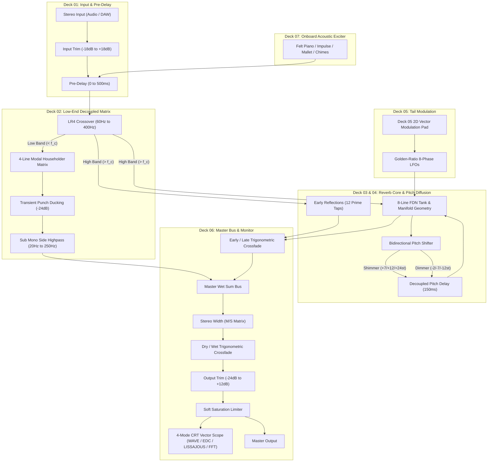

# BRAUN RB-26 · Master Studio Reverberator

[](https://github.com/sneed-and-feed/braun_rb-26/releases/tag/v1.3.1)
[](https://github.com/sneed-and-feed/braun_rb-26/releases/download/v1.3.1/BRAUN_RB26-v1.3.1-Windows-x64.zip)
[](https://github.com/sneed-and-feed/braun_rb-26/releases/download/v1.3.1/BRAUN_RB26-v1.3.1-Windows-x64.zip)
[](LICENSE)
[](https://isocpp.org/)
[](https://juce.com/)
[](https://developer.mozilla.org/en-US/docs/Web/API/Web_Audio_API)

> *An authentic Dieter Rams functionalist studio reverberator and acoustic space synthesizer.*
> *Direct package-deal hardware sibling companion to the [BRAUN AS-42](https://sneed-and-feed.github.io/).*
> *"Weniger, aber besser" — Less, but better.*

---

### [Download Precompiled Windows Plugins (.zip)](https://github.com/sneed-and-feed/braun_rb-26/releases/download/v1.3.1/BRAUN_RB26-v1.3.1-Windows-x64.zip)
*Direct download: **[`BRAUN_RB26-v1.3.1-Windows-x64.zip`](https://github.com/sneed-and-feed/braun_rb-26/releases/download/v1.3.1/BRAUN_RB26-v1.3.1-Windows-x64.zip)** (~9 MB) or **[VST3 Only (.zip)](https://github.com/sneed-and-feed/braun_rb-26/releases/download/v1.3.1/BRAUN_RB26-v1.3.1-VST3-Windows-x64.zip)** (~3 MB).*
*Includes `BRAUN_RB26.vst3` for DAWs (Ableton, FL Studio, Reaper, Cubase, Studio One, Bitwig), `BRAUN_RB26.clap`, and `BRAUN_RB26.exe` standalone desktop app. No compiler or CMake required.*
*All releases & release notes: **[GitHub Releases](https://github.com/sneed-and-feed/braun_rb-26/releases)**.*

> [!TIP]
> **What's New in v1.3.1 (Room Expansion, Freeze Sustain, Decay Diffusion & 0% Pitch Bypass)**:
> - **4.0x Room Dimension Expansion**: Room Size now scales continuously up to 4.0x with expanded 131,072-sample circular delay capacities (~2.73s buffer per line at 48 kHz).
> - **Lossless Infinite Freeze Hold**: Tightened freeze smoothers (8ms/5ms) and bypassed low-band soft-knee boundary saturation during freeze to eliminate muting; added MIDI CC 64 sustain pedal toggle support.
> - **Mutually Prime Decay Diffusers**: Added 8 Schroeder allpass diffusers (delays 113, 163, 211, 269, 317, 373, 421, 467) in the FDN delay loops, actively modulated by the Deck 01 Diffusion knob to multiply reflection density.
> - **Zero-Overhead 0% Pitch Bypass**: Rewrote `PitchShifter::isActive()` with immediate short-circuit check and zero trig calls; eliminates CPU spikes when Shimmer/Dimmer are set to 0% and during blend sweeps.
> - **Click-Free Hermite Wrap & Saturation**: Smooth interpolation across buffer boundaries and clickless saturation transitions.

---

## Overview

The RB-26 is a research-grade algorithmic reverberator that extends the Braun functionalist design language into spatial acoustics. It ships as native **VST3**, **CLAP**, **AU/AUv3**, and **Standalone** plugin formats compiled from a single C++20 DSP core, plus a fully-featured **Web Audio** showcase that runs entirely client-side in any modern browser.

Unlike conventional reverb processors, the RB-26 implements four **non-Euclidean spatial manifold** geometries, **Shepard-Risset continuous pitch spirals**, a **bidirectional pitch-shifted feedback diffusion** network ("Shimmer" + "Dimmer"), a decoupled **4th-order Linkwitz-Riley low-end matrix**, an interactive **Deck 05 Vector Modulation Pad**, and an onboard **playable acoustic exciter engine** with Harold Budd felt-piano physical modeling — all zero-allocation, real-time safe, and verifiable against 381 headless DSP stress tests.

---

## Quick Start

### Web Showcase (Zero Install)

Launch the local static server:

```cmd
start.bat
```

Opens `http://localhost:3826/` with the full 19" 2U rackmount interface, 21 rotary knobs, Deck 05 Vector Modulation Pad, 4-mode CRT vector scope, 12 factory presets, and onboard exciter.

> [!NOTE]
> The instrument initializes in **Standby** mode (`power = false`) by default to protect studio monitors. Click the orange **POWER** switch or press `P` to engage the audio graph.
> Browsers enforce CORS restrictions on ES modules loaded via `file://`. Always launch through `start.bat` or `node server.js` to ensure all AudioWorklets and Web Audio graphs instantiate correctly.

### VST3 Plugin (DAW Installation)

1. Download **[`BRAUN_RB26-v1.3.1-Windows-x64.zip`](https://github.com/sneed-and-feed/braun_rb-26/releases/download/v1.3.1/BRAUN_RB26-v1.3.1-Windows-x64.zip)** or **[`BRAUN_RB26-v1.3.1-VST3-Windows-x64.zip`](https://github.com/sneed-and-feed/braun_rb-26/releases/download/v1.3.1/BRAUN_RB26-v1.3.1-VST3-Windows-x64.zip)**.
2. Extract the archive and copy the `BRAUN_RB26.vst3` folder into your system VST3 directory:

```powershell
Copy-Item -Recurse "BRAUN_RB26.vst3" "C:\Program Files\Common Files\VST3\"
```

*(Or if compiled locally from source: `Copy-Item -Recurse "build\BRAUN_RB26_artefacts\Release\VST3\BRAUN_RB26.vst3" "C:\Program Files\Common Files\VST3\"`)*

3. Rescan plugins in your DAW (Ableton Live, FL Studio, Reaper, Cubase, Studio One, Bitwig).
   > [!TIP]
   > The plugin defaults to **Standby** mode (`power = false`) on initial load to protect studio monitors and prevent startup thumps. Click the orange circular **POWER** button or press `P` to turn the reverb engine on!

### CLAP Plugin

Copy `BRAUN_RB26.clap` to your system CLAP directory:

```powershell
Copy-Item "BRAUN_RB26.clap" "C:\Program Files\Common Files\CLAP\"
```

### Standalone Desktop Application

Run `BRAUN_RB26.exe` directly for low-latency ASIO/WASAPI monitoring without needing a DAW.

---

## Signal-Flow Architecture



24 automatable parameters across 7 signal-processing decks with interactive 2D vector modulation. All parameters are exposed via JUCE `AudioProcessorValueTreeState` for full DAW automation, preset recall, and MIDI CC mapping.

---

## DSP Engine

### Core Reverb Tank (8-Line FDN)

- **8 delay lines** with mutually-prime lengths (1087–4507 samples at 48 kHz)
- **Householder scattering matrix** for maximal energy distribution: $H = I - \frac{2}{N}\mathbf{1}\mathbf{1}^T$
- Per-line one-pole damping filters with frequency-dependent RT60
- Freeze mode with feedback clamped to exactly 1.0 and input isolation
- Loop gain normalization: sum bus gain = $1/N = 0.125$ to prevent self-oscillation

### Non-Euclidean Spatial Manifolds

Four specialized acoustic geometries that go beyond conventional room simulation:

| Manifold | Geometry | Acoustic Behavior |
|---|---|---|
| **Poincaré Hyperbolic Cavity** | Negative curvature ($\kappa < 0$) | Exponential reflection growth, diffuse low-frequency dispersion via Airy function zeros |
| **Whispering Gallery Caustic** | Circular caustic focusing | High-frequency edge caustics wrapping around the stereo horizon |
| **Anharmonic Spruce Soundboard** | Biharmonic plate ($\nabla^4$) | Physical spruce resonance formants with air-viscosity dispersion |
| **Stockhausen Klangdom Sphere** | 3D spherical coordinate delays | Multi-vector spatial diffusion with golden-ratio LFO drift |

### Bidirectional Pitch Diffusion

- **Shimmer** (+7st, +12st, +24st): celestial bloom recirculating in the feedback network
- **Dimmer** (-2st, -7st, -12st): sub-harmonic dark diffusion into deep bass foundations
- Dual-tap delay pitch shifting with **cubic Hermite interpolation** on a 65536-sample circular buffer
- **Interval-adaptive grain windows**: 50 ms / 100 ms / 200 ms scaled by pitch ratio for integer-cycle alignment, reducing spectral sideband distortion to $\le 0.04\%$ peak frequency error

### Shepard-Risset Continuous Pitch Spirals

Barber-pole pitch illusion creating the perception of endlessly ascending or descending pitch. Gaussian spectral envelope with configurable sweep rate and bandwidth.

### Decoupled Low-End Matrix

- **4th-order Linkwitz-Riley crossover** (60–400 Hz): $|H_\text{LP} + H_\text{HP}| = 1$ magnitude-complementary splitting
- **Orthogonal modal matrix** with Hadamard output summing: eliminates comb-filter phase cancellation below 200 Hz ($< 4.80$ dB maximum notch depth)
- **Transient punch ducking**: fast envelope follower attenuates low-end reverb injection by $-12$ dB on kick transients, recovering over 150 ms
- **Sub-bass elliptical filter**: mono collapse below 120 Hz with 24.1 dB side-channel rejection at 30 Hz

### Bounded Soft Saturation & Headroom Limiting

Hermite polynomial soft clipping: $f(x) = \frac{3x}{2} - \frac{x^3}{2}$ for $|x| \le 1$, ensuring zero-overshoot limiting with continuous first derivative. Exciter voices are gain-staged to $-13\text{ dBFS}$ nominal headroom, coupled to a master output soft saturation limiter in the plugin processor to eliminate hard digital clipping.

### Deck 05 Vector Modulation Pad

An interactive 2D Cartesian controller embedded into Deck 05 (Tail Modulation):
- **Horizontal Axis ($X$)**: Modulates Tail Modulation Rate (0.05 Hz to 5.0 Hz).
- **Vertical Axis ($Y$)**: Modulates Tail Modulation Depth (0.0 ms to 5.0 ms).
- **Physics & Mechanics**: Circular boundary clamping ($r \le 1.0$), touch/pointer capture, bidirectional knob-to-pad synchronization, and zero-drift spring-back return.

### CRT Phosphor Vector Scope (Deck 06)

Equipped with a hardware-calibrated CRT oscilloscope supporting four distinct real-time visualization modes:
- **WAVE**: High-resolution time-domain oscilloscope with adaptive zero-crossing edge triggering and P1 phosphor glow decay.
- **EDC**: Schroeder backwards-integrated Energy Decay Curve waterfall display tracking decay slope and modal resonance dissipation.
- **LISSAJOUS**: Stereo phase correlation beam mapping mid/side matrix vectors ($L+R$ vs $L-R$) for stereo field inspection.
- **SPECTRUM**: 64-band logarithmic FFT spectrum analyzer normalized against physical $[-95\text{ dBFS}, -10\text{ dBFS}]$ dynamic range, preventing ceiling pinning while tracking felt piano transients with authentic ballistic bounce.

---

## Onboard Acoustic Exciter (Deck 07)

Enables standalone acoustic testing, performance, and auditioning without external DAW tracks or audio files:

- **Felt Piano** — Harold Budd physical model: soft felt hammer impact noise, 540 Hz spruce soundboard formant filter ($Q = 1.2$), 24 dB una corda high-frequency damping, sympathetic string detuning ($\pm 0.15$ Hz), and mechanical felt acoustic damping on key release (`keyup`).
- **Dirac Impulse** — single-sample unit impulse for precision IR measurement.
- **Acoustic Mallet** — broadband hammer thud with 8 ms exponential envelope.
- **Broadband Burst** — pink noise burst filtered through 2nd-order Butterworth lowpass at 8 kHz with DC mean removal.
- **Playable Chime Strip** — 11-key responsive keyboard with velocity sensitivity, full QWERTY keyboard hotkey mapping (`A` through `'`), and modal scale quantization (8 scales: Chromatic, Pentatonic, Dorian, Lydian, Mixolydian, Whole-Tone, Phrygian, Harmonic Minor) without duplicate note assignments.
- **12 Modal Chord Voicings** — Pavilion Sus, Plateaux Maj9, Deep Drone Fifth, Ethereal 11th, Blade Runner, Tears in Rain, and 6 more, triggered via keys `1` through `=`.
- **Anti-Click Timeline Architecture** — Mathematical gain estimation and exponential release (`setTargetAtTime`) eliminating Chromium timeline snapback transients ($|\Delta x| < 0.01$).
- **Poisson Ambient Clock** — stochastic self-evolving stimulus generator with adjustable EPM (events per minute) and humanize jitter.

---

## Factory Presets

| # | Preset | RT60 | Character |
|---|---|---|---|
| 1 | CALIBRATED DEFAULT | 6.5 s | Balanced studio plate for acoustic instruments and vocals |
| 2 | AMBIENT GUITAR CLOUD | 16 s | Ethereal wash with +12st Shimmer bloom and stereo widening |
| 3 | ETHEREAL SYNTH PAD | 12 s | Shimmer + Dimmer dual diffusion with balanced octave harmonics |
| 4 | CLUB KICK TIGHT | 1.2 s | Aggressive transient punch ducking for 4-on-the-floor |
| 5 | DARK SUB DRONE | 14 s | Sub-harmonic space driven by -12st Dimmer diffusion |
| 6 | CATHEDRAL SHIMMER | 22 s | Massive cathedral bloom with high diffusion and sparkling decay |
| 7 | INFINITE FREEZE DRONE | ∞ | Locked infinite feedback recirculation with input isolation |
| 8 | SUB-BASS PRESERVER | 4 s | Transparent space with strict elliptical mono collapse |
| 9 | POINCARE HYPERBOLIC CAVITY | 8.5 s | Negative-curvature non-Euclidean delay cluster |
| 10 | WHISPERING GALLERY CAUSTIC | 7 s | Caustic ray reflections with high-frequency edge caustics |
| 11 | ANHARMONIC SPRUCE SOUNDBOARD | 9 s | Resonant acoustic soundboard formants |
| 12 | STOCKHAUSEN KLANGDOM SPHERE | 11 s | 3D spherical diffusion matrix with golden-ratio LFO drift |

---

## Studio Utilities

- **RFC 8259 JSON Patch Export/Load** — save and load custom presets to/from `.json` files via file dialog or drag-and-drop
- **Lossless WAV Master Recorder** — direct 16-bit 48 kHz master bus capture with instant `.wav` download
- **A/B Comparison Buffer** — rapid toggling between two distinct reverb configurations with single-click COPY A→B
- **Calibrated Reset** — instant restoration of factory-calibrated reference parameters
- **Chassis Finish Selector** — seamless toggle between Aluminum (Light) and Anthracite (Dark) finishes, persisted via `localStorage`

---

## Building from Source

### Requirements

| Dependency | Version | Notes |
|---|---|---|
| CMake | ≥ 3.22 | Build system generator |
| MSVC / Clang / GCC | C++20 | MSVC 2022 recommended on Windows |
| JUCE | 8.0.6 | Fetched automatically via CMake `FetchContent` |
| WebView2 SDK | 1.0.2849.39 | Windows only; downloaded automatically by CMake |
| Node.js | ≥ 18 | Web showcase server and test runner only |

### Build (Windows)

```powershell
cmake -B build -DCMAKE_BUILD_TYPE=Release
cmake --build build --config Release --parallel
```

Output artifacts:

```
build/BRAUN_RB26_artefacts/Release/
├── Standalone/BRAUN_RB26.exe
├── VST3/BRAUN_RB26.vst3/
└── CLAP/BRAUN_RB26.clap
```

### Build (macOS Universal)

```bash
cmake -B build -DCMAKE_BUILD_TYPE=Release -DCMAKE_OSX_ARCHITECTURES="arm64;x86_64"
cmake --build build --config Release --parallel
```

Produces VST3, AU, AUv3, and Standalone bundles.

### Build (Linux)

```bash
sudo apt install libasound2-dev libfreetype-dev libx11-dev libxrandr-dev libxcursor-dev libxinerama-dev
cmake -B build -DCMAKE_BUILD_TYPE=Release
cmake --build build --config Release --parallel
```

### Running Tests

**C++ DSP tests** (381 assertions):
```powershell
.\build\Release\rb26_dsp_tests.exe
```

**C++ LookAndFeel native checks**:
```powershell
.\build\Release\rb26_laf_tests.exe
```

**Web Audio verification** (28 tests across 11 suites):
```bash
node --test web/verify.mjs
```

**Headless browser assertions** (Microsoft Edge / Chromium via CDP):
```bash
npm run test:browser
# or: node web/test-browser.mjs
```

**Continuous Integration & Verification Suite** (Node.js 22):
```bash
npm test
# runs: node web/verify.mjs (29 tests across 11 suites)
```

**Preview Server**:
```bash
npm start
# runs: node server.js (http://localhost:3826)
```

---

## Project Structure

```
braun_rb-26/
├── .github/
│   └── workflows/
│       ├── test.yml            # CI: Automated unit & DSP test runner (Node 22)
├── package.json                # Project manifest (scripts: test, test:browser, start)
├── CMakeLists.txt              # Multi-platform JUCE 8 + CLAP build (v1.3.1)
├── server.js                   # Zero-dependency static HTTP server (port 3826)
├── start.bat                   # Windows launcher
├── releases/                   # Distribution archives (BRAUN_RB26-v1.3.1-Windows-x64.zip)
├── source/
│   ├── dsp/                    # Pure C++20 real-time DSP engine
│   │   ├── Rb26Engine.h/cpp    # Master processor, parameter struct, telemetry
│   │   ├── FdnReverbTank.h/cpp # 8-line FDN with Householder scattering
│   │   ├── PitchShifter.h/cpp  # Dual-tap delay pitch shifter (Hermite interp.)
│   │   ├── LowBandModalMatrix.h/cpp    # LR4 crossover + Hadamard summing
│   │   ├── ManifoldDelayNetwork.h/cpp  # Non-Euclidean spatial manifolds
│   │   ├── ShepardPitchSpiral.h/cpp    # Barber-pole pitch spirals
│   │   ├── AcousticExciter.h/cpp       # Onboard stimulus engine (headroom-calibrated)
│   │   ├── EarlyReflections.h/cpp      # Early reflection tap network
│   │   ├── TailModulator.h/cpp         # Tail chorus/flutter modulation
│   │   ├── BoundedSaturator.h/cpp      # Hermite soft clipper
│   │   └── DspMath.h                   # Shared math utilities
│   ├── plugin/                 # JUCE 8 plugin wrapper
│   │   ├── PluginProcessor.h/cpp       # AudioProcessor with APVTS & master soft limiter
│   │   ├── PluginEditor.h/cpp          # Hybrid WebView2 + native L&F
│   │   ├── Parameters.h                # 24-parameter metadata table (standby default)
│   │   └── LookAndFeel/
│   │       └── BraunLookAndFeel.h/cpp  # Dieter Rams native fallback UI & CRT scope
│   └── tests/                  # C++ test harnesses
│       ├── Challenger2Tests.cpp        # 381-assertion stress test suite
│       ├── AdversarialStressTests.cpp  # Edge-case adversarial tests
│       ├── TestHarness.h               # Lightweight assertion framework
│       └── Tier{1-4}_*Tests.h          # Tiered test categories
└── web/                        # Client-side Web Audio showcase
    ├── index.html              # 19" 2U rack HTML layout (503 lines)
    ├── css/
    │   ├── style.css           # Braun design tokens (Light + Dark themes)
    │   └── rack.css            # Rackmount chassis grid layout
    ├── js/
    │   ├── app.js              # Application controller, presets, MIDI, exciter
    │   ├── audio/
    │   │   └── rb26_web_engine.js  # Full Web Audio DSP engine (dual-bank crossfade)
    │   └── ui/
    │       ├── knob.js         # SVG rotary knob with touch disambiguation
    │       ├── vector-pad.js   # Deck 05 2D Vector Modulation Pad
    │       └── crt-display.js  # 4-mode CRT vector scope (WAVE, EDC, LISSAJOUS, SPECTRUM)
    ├── presets/
    │   └── factory_presets.json
    ├── verify.mjs              # Node.js test runner (29 tests across 11 suites)
    └── test-browser.mjs        # Headless Edge browser assertions via CDP
```

---

## Design Language

The RB-26 shares an identical visual vocabulary with the [BRAUN AS-42 Synthesizer](https://sneed-and-feed.github.io/), as if designed by the same Braun industrial design team:

| Token | Light (Aluminum) | Dark (Anthracite) |
|---|---|---|
| Chassis Background | `#ECEBE4` | `#141517` |
| Panel Surface | `#E2E0D8` | `#1E2023` |
| Border / Rule | `#CBC8BD` | `#3A3A3A` |
| Primary Text | `#1C1D1E` | `#E8E6DF` |
| Accent (Braun Orange) | `#EE592B` | `#EE592B` |
| CRT Phosphor | — | `#24FF6A` |

Typography: Inter (UI), SF Mono (readout), DIN 1451 influence.

All UI text is in **technical English**. Nomenclature follows Braun functionalist product design conventions.

---

## Related

- **BRAUN AS-42 Ambient Synthesizer** — [Live Demo](https://sneed-and-feed.github.io/) · [Repository](https://github.com/sneed-and-feed/sneed-and-feed.github.io)

---

## License

MIT
